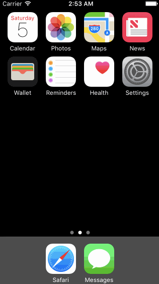

# W4 Assignment: *Tumblr*

[Instructions](http://courses.codepath.com/courses/ios_for_designers/unit/4#!assignment)

[Assets](https://www.dropbox.com/s/3bhiowjbs6fgpgb/Tumblr%20Assets%202.zip?dl=0)

**Tumblr** has been programmatically animated with Swift (iOS).

Purpose: leverage animations and gestures to create custom navigation. We're going to use the techniques from this week to implement some interactions in Tumblr.

Submitted by: [Sophia Kecir Camper](https://github.com/sophiakc)

Total time spent: **10** cumulated hours

## Required User Stories

* [X] Tapping on Home, Search, Account, or Activity should show the respective screen and highlight the tab bar button.
* [X] Compose button should modally present the compose screen.

## Optional User Stories

* [ ] Compose screen is faded in while the buttons animate in.
* [ ] Login button should show animate the login form over the view controller.
* [ ] Discover bubble should bob up and down unless the SearchViewController is tapped.

## Video Walkthrough

## Notes / Challenges encountered while building the app:

Please list two areas of the assignment you'd like to **discuss further with your peers** during the next class (examples include better ways to implement something, how to extend your app in certain ways, etc):

1. 
2. 

## License

    Copyright [2016] [Sophiakc.com](http://www.sophiakc.com)

    Licensed under the Apache License, Version 2.0 (the "License");
    you may not use this file except in compliance with the License.
    You may obtain a copy of the License at

        http://www.apache.org/licenses/LICENSE-2.0

    Unless required by applicable law or agreed to in writing, software
    distributed under the License is distributed on an "AS IS" BASIS,
    WITHOUT WARRANTIES OR CONDITIONS OF ANY KIND, either express or implied.
    See the License for the specific language governing permissions and
    limitations under the License.
